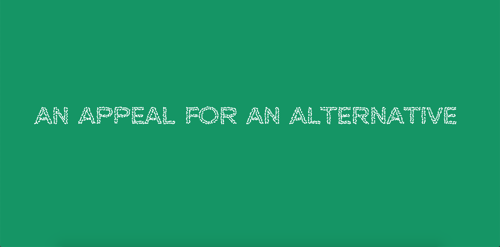
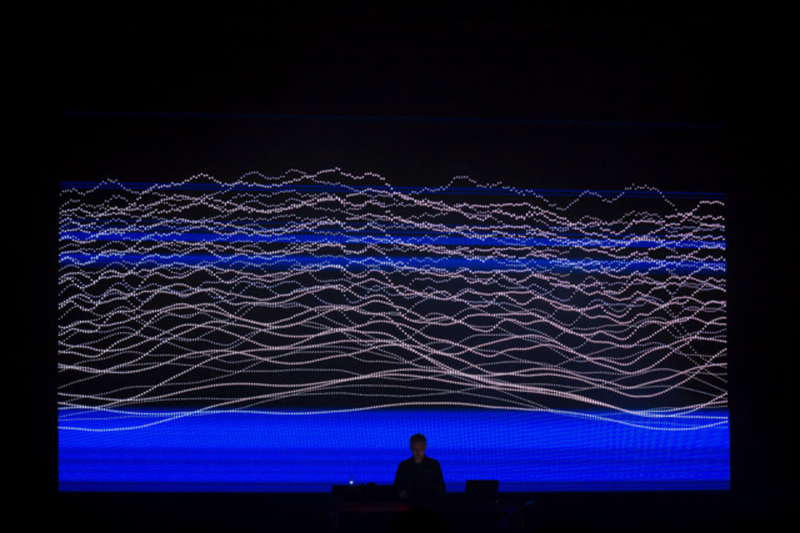

# Work in Progress - Week 09
## Flocking Experimentation
This week I started to have a better look at what is going to form the main structure of my Major Assignment, a flocking system, which moves cells to certain points on the screen to form words and phrases from Joseph Beuys, An Appeal for an Alternative. This is a way of interpretating his call for the Free International University as a place for people to communicate and work through the worlds crises (Military, Ecological, Economic, Consciousness). 

Using The Coding Train's [*video*](https://www.youtube.com/watch?v=4hA7G3gup-4&ab_channel=TheCodingTrain) about steering behaviours as the foundation (as well as [*particle clock*](https://www.openprocessing.org/sketch/448956) of the physics system I created a basic sketch to show the capabilities of the structure. Outcome link [*here*](https://fergarundel.github.io/CODE-WORDS/week_09/cells/). Using the foundation I experimented with making the cells seem more alive and dynamic by giving them a vibrating effect. I am interesting in using libraries, such as p5.particle, as the foundation for the physics system inside the sketch so I can play around with and experiment with the system further.



### Vehicle Class taken from Daniel Shiffman

``` javascript
class Vehicle {
  constructor(x,y){
    this.pos = createVector(random(width),random(height));
    this.target = createVector(x,y);
    this.vel = createVector();
    this.acc = createVector();
    this.maxspeed = 8;
    this.maxforce = 0.3;
  }
 
  behaviours(){
    let arrive = this.arrive(this.target);  
    this.applyForce(arrive);    
  }
  
  
  applyForce(f){
    this.acc.add(f);    
  }
  
  arrive (target){
    let desired = p5.Vector.sub(target,this.pos);
    let d = desired.mag();
    let speed = this.maxspeed;
    if (d<100){
      speed = map(d,0,100,0,this.maxspeed);
    }
    desired.setMag(speed);
    let steer = p5.Vector.sub(desired,this.vel);
    steer.limit(this.maxforce);
    return steer;

  }
  
  update (){
    this.pos.add(this.vel);
    this.vel.add(this.acc);
    this.acc.mult(0);
}

  show (size) {
    stroke (255);
    strokeWeight(size);
    point(this.pos.x+random(-1,1),this.pos.y+random(-1,1));
}
}
```
### Sketch using Vehicle Class

``` javascript
let font;
let vehicles = [];
let text = 'AN APPEAL FOR AN ALTERNATIVE';

function preload(){
  font = loadFont('data/NeueMetana-Regular.otf');
}

function setup() {
  createCanvas (windowWidth,windowHeight);  
  
    var cells = font.textToPoints(text,90,height/2,60,{ 
      sampleFactor: .3,
    });
  
  for (var i = 0;i < cells.length;i++){
    var cell = cells[i];
    var vehicle = new Vehicle(cell.x,cell.y);
    vehicles.push(vehicle);
  }

}


function draw() {
  background(0,150,100);
  
  for (var i =0; i < vehicles.length ;i++){
    var vehicle = vehicles [i];
    vehicle.behaviours();
    vehicle.update();
    vehicle.show(2);
  }
}
```

### Continuing 
With continuing this sketch I will have to find a way make the text change and morph into new phrases, the trouble I am having with this is that the initial phrases, 'An Appeal for an Alternative', is in the setup() function, meaning that updating this I will have to move it into a looping function such as draw(), that allows me to constantly update the position of the cells. 

## Inspiration - Alva Noto


Alva Noto is a German artist who intertwines the audio and visual aspects of his work creating atmospheric live sets and mesmorising music videos. His visuals used at his [*concerts*](https://www.youtube.com/watch?v=Y_-hKHbO-GE&ab_channel=Manchine) and [*other projects*](https://www.youtube.com/watch?v=MkyufPrxdiA&ab_channel=bacteriasleep) interacts with his music similar to Ryoji Ikeda. This is something I will be trying to incorporate into my sketches in the future to add an atmospheric and more organic feel to my work. The audio aspect of my work will be connected to the movement of the cells when forming new phrases and words making the cells seem more alive and dynamic.
