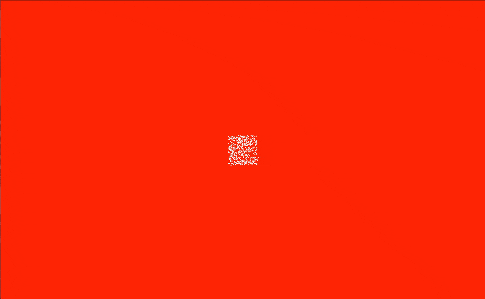

# Final Presentations - Week 12

## Continuing Troubleshooting
As I said last week, with the changes I made in order to make every transition the same time I inadvertently made it so the inital click doesn't immediately begin the cycle of text but makes the cells go to random target first. This creates an awkward looking beginning so I decided to begin the sketch with the cells congregated in the centre of the screen in the form of a square. This creates a more appealing aestehtic when the user first opens the page. This formation can also be viewed as symbolic of the physical space of the Free International University which adds another layer to the outcome.

Old starting position:

```Javascript
  for (var i = 0;i < 500;i++){
    var vehicle = new Vehicle(random(width),random(height));
    vehicles.push(vehicle);    
  } 
```
New starting position:

```Javascript
  for (var i = 0;i < 500;i++){
    var vehicle = new Vehicle(random(width/2 +30,width/2 -30),random(height/2 +30,height/2 -30));
    vehicles.push(vehicle);    
  } 
```


## Styling Decisions

### Colour


So far I have been using a red background in order to symbolise the urgency of Beuys' message, however I think the black background can be used to create a more effective and immersive atmosphere, especially when (hopefully) paired with sound. So a more stripped back black and white colour scheme with be what I will present my final outcome in.

### Typography


As suggested by Andy last week, I looked into single line fonts and how they would work in my sketch. The one above on the right called [*Dotline*](https://www.fontspace.com/dotline-font-f6023) was one which I found interesting, however I think that the thinness of the lines make it look delicate and frail, making it not suitable for Beuys call for social revolution. I have decided to stick with the classic Helvetica, which in a way is an "International" font, being used all over the world. What I would've liked to look into was making the typography truely international with [*Google's Noto Fonts*](https://www.google.com/get/noto/). Noto fonts aims to support all languages (currently supporting 582 from 237 regions), with this ability I would like to look into making the text language randomly generated each time you enter the site in order to signifiy the International aspect of Beuys' text. Unfortunately, I wont have time to add this into my outcome, however it is something I could further refine later.

## Sound Design

The last step in my outcome was sound, in order to create an atmospheric environment where the outcome can live, the sound will have to immerse the user, using layering to create dynamic change when the cells are moving. For the background sound I wanted to have a [*droning sound*](http://soundimage.org/wp-content/uploads/2016/08/Dystopic-City-Drone.mp3) which can loop continuously in the background in order to build this slightly tense ambience. For the transition period I decided upon the beginning few seconds of Ben Bondy's [*Eeon*](https://bblisss.bandcamp.com/track/eeon), I have used Ben Bondy's work previously in my initial [*sound test*](https://fergarundel.github.io/CODE-WORDS/week_06/SoundTest/). This electronic ambience created through this snippet is one of my favourite things about the whole sketch. Lastly for the movement of cells within the sentence I used a [*low bass kick*](https://freesound.org/people/kbeezy88/sounds/501757/) to signify the change in text. All together I think they accompany each other really well and help tie the sketch together.

---

### [[Previous Week]](https://fergarundel.github.io/CODE-WORDS/week_11/) - [[Final Outcome]](https://fergarundel.github.io/CODE-WORDS/week_12/cells_final/)

